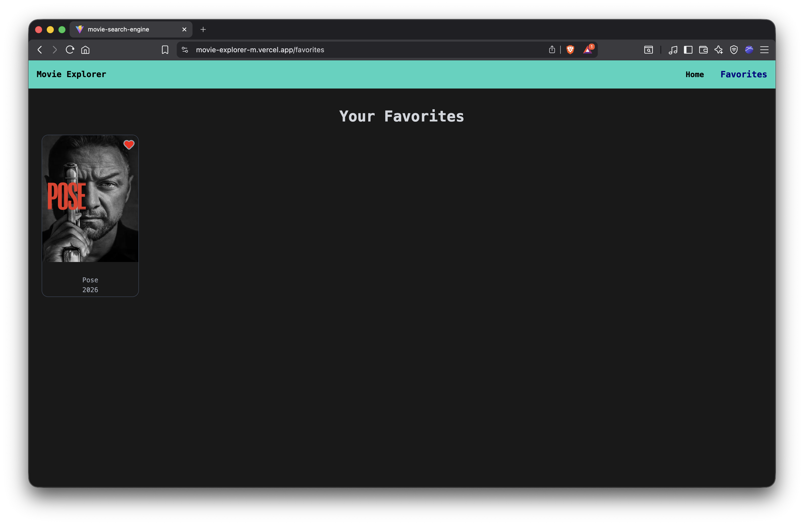

# 🎬 Movie Explorer

A modern **React Movie Explorer App** that allows users to browse popular movies, search for movies, and save their favorite movies.

This project uses **The Movie Database (TMDB) API** and demonstrates real-world frontend features like pagination, debounced search, favorites with local storage, and responsive UI.

🌐 **Live Demo:** https://movie-explorer-m.vercel.app

---

# 🚀 Features

- 🔍 **Search Movies** with debounce (auto search after typing)
- 🎞 **Browse Popular Movies**
- ❤️ **Add / Remove Favorites**
- 💾 Favorites stored in **Local Storage**
- 📄 **Pagination**
- ⚡ **Skeleton Loading UI**
- 📱 **Responsive Design** (mobile friendly)
- 🌐 **API Integration with TMDB**

---

# 🛠 Tech Stack

Frontend:
- React
- Tailwind CSS
- React Router

State Management:
- Context API

API:
- TMDB API

Deployment:
- Vercel

---

# 📸 Screenshots

# 📸 Screenshots

## Home Page


## Favorites Page


---

# ⚙️ Installation

Clone the repository

```bash
git clone https://github.com/manojrahar/Movie-Explorer.git
```

Go into the project directory

```bash
cd Movie-Explorer
```

Install dependencies

```bash
npm install
```

Create a `.env` file and add your TMDB API key

```
VITE_TMDB_API_KEY=your_api_key_here
```

Run the project

```bash
npm run dev
```

---

# 📂 Project Structure

```
src
 ├── Components
 │   ├── MovieCard.jsx
 │   ├── Navbar.jsx
 │   ├── Pagination.jsx
 │   └── SkeletonCard.jsx
 │
 ├── Context
 │   └── MovieContext.jsx
 │
 ├── Pages
 │   ├── Home.jsx
 │   └── Favorites.jsx
 │
 └── services
     └── api.js
```

---

# 🧠 What I Learned

- Building reusable React components
- Managing global state using Context API
- Implementing pagination with API data
- Handling loading states with Skeleton UI
- Making responsive layouts with Tailwind CSS
- Deploying React applications on Vercel

---

# 🔗 Links

GitHub Repository  
https://github.com/manojrahar/Movie-Explorer

---

# 👨‍💻 Author

**Manoj Rahar**

Frontend Developer  
Building in Public 🚀
